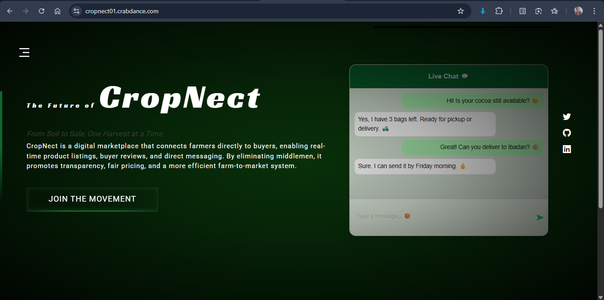
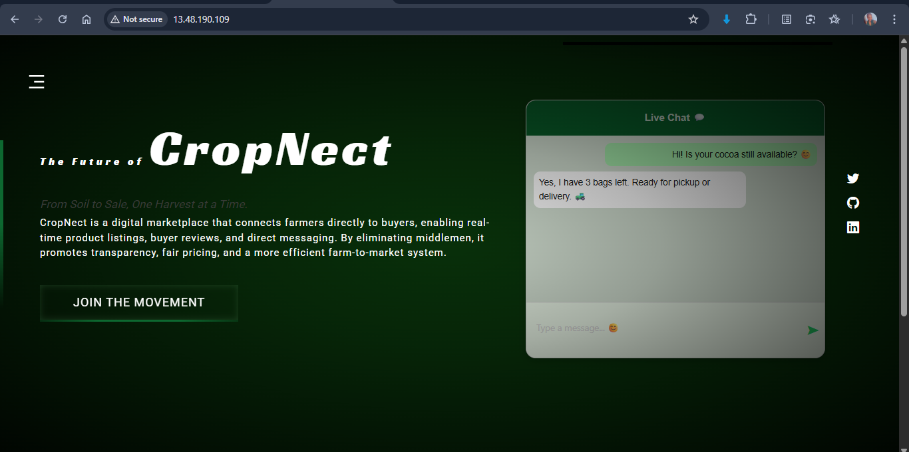
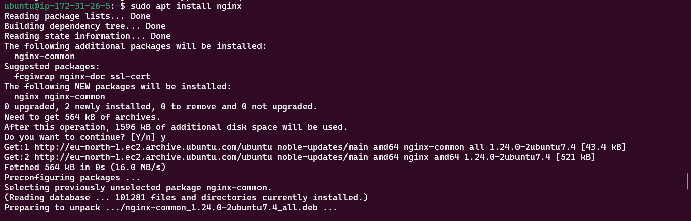
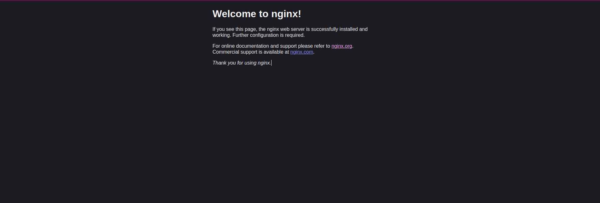
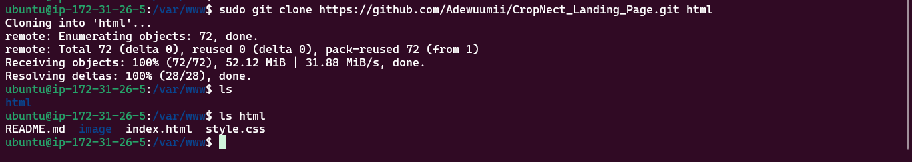
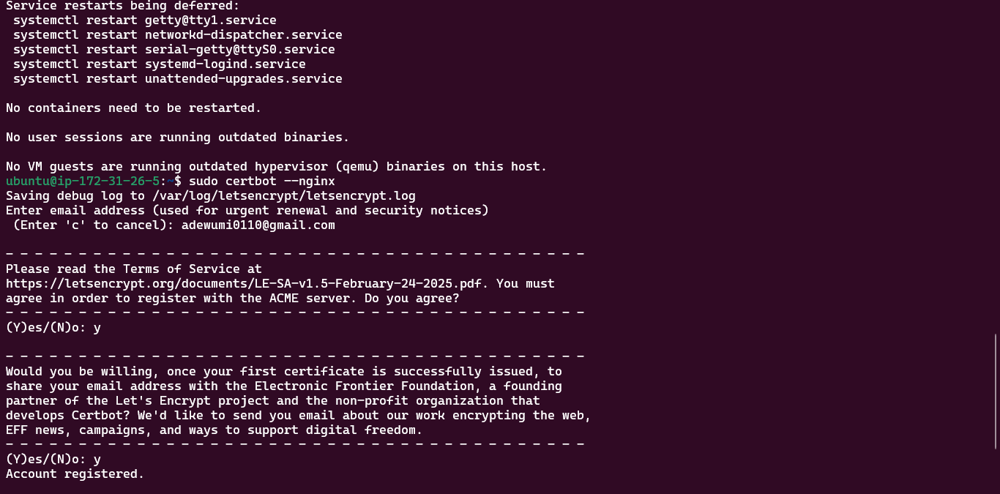
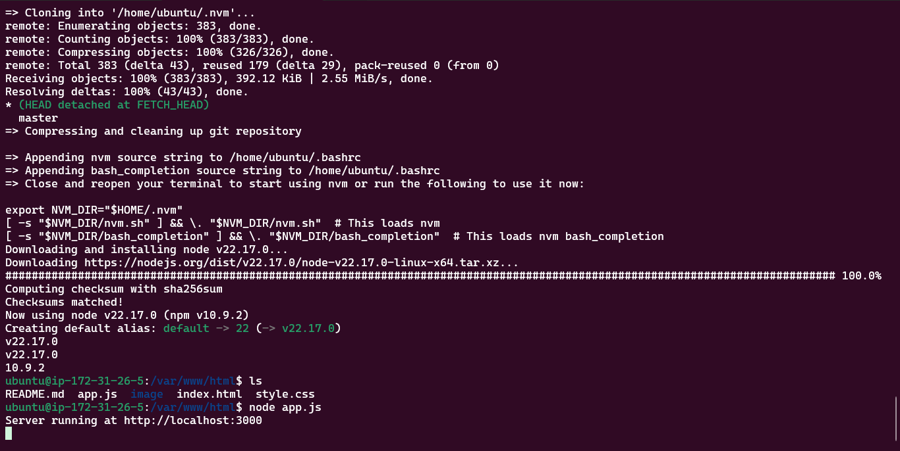
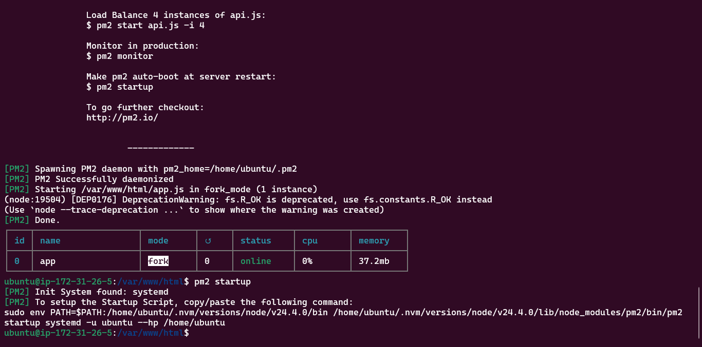
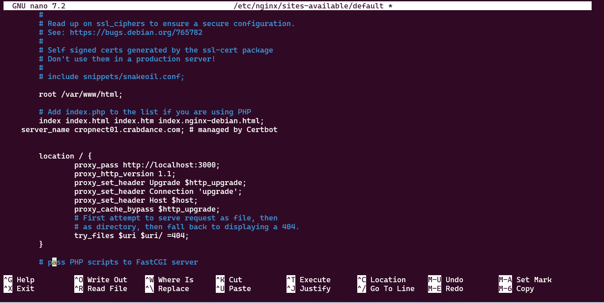

# CropNect - A Digital Marketplace for Farmers

CropNect is a dynamic web-based landing page for an agri-tech platform that connects farmers directly to buyers, enabling real-time communication, transparency, and efficiency in farm produce trading.

This document details the steps I took to successfully deploy the CropNect landing page to an AWS EC2 instance using Node.js, Nginx, and Certbot.

---

## Live Site

**URL**: [https://cropnect01.crabdance.com](https://cropnect01.crabdance.com)

**Public IP Address**: `13.48.190.109`

**NOTE**: This project was previously hosted on an AWS EC2 instance as part of a deployment exercise. The instance has since been terminated to prevent ongoing charges. So the link to the live site and the public IP address is no longer available.

### Screenshot





---

## Server Setup

To begin, I launched a new EC2 instance on AWS using the Ubuntu 22.04 LTS AMI and a t3.micro instance type. During setup, I configured the security group to allow:

- SSH (port 22) from my IP only
- HTTP (port 80) from anywhere
- HTTPS (port 443) from anywhere

Once the instance was running, I connected to it using SSH:

```bash
ssh -i key.pem ubuntu@13.48.190.109
```

---

## Web Server Installation (Nginx)

I chose Nginx as my web server. After updating the package list, I installed and started Nginx:

```bash
sudo apt update && sudo apt upgrade -y
sudo apt install nginx -y
```



At this point, visiting the public IP displayed the default Nginx welcome page.



---

## Project Deployment Preparation

To deploy the project, I installed Git and cloned the repository containing my landing page into the html folder inside the `/var/www/` directory:

```bash
sudo apt install git -y
sudo git clone https://github.com/Adewuumii/CropNect_Landing_Page.git html
```



At this point, I have successfully changed the landing page from the Nginx default welcome page to my website page.

---

## Domain Setup

To use a custom domain with my EC2 instance, I registered a free subdomain using `afraid.org`, choosing `cropnect01.crabdance.com` as my domain name.

I created an A record that pointed to my EC2 public IP. After waiting briefly for the DNS to propagate, the domain began serving the content hosted on my EC2 instance.

This domain was later used to issue a valid HTTPS certificate via Certbot.

---

## Securing the Connection with Certbot

To secure the site, I installed Certbot with the Nginx plugin:

```bash
sudo apt install certbot python3-certbot-nginx -y
```

Then I obtained an SSL certificate for my domain:

```bash
sudo certbot --nginx
```



---

## Node.js and PM2 Setup

Since I was using a simple Node.js server (`app.js`) to serve my content, I needed to install Node.js. I installed Node.js using NVM (Node Version Manager) for flexibility in managing Node versions:

```bash
curl -o- https://raw.githubusercontent.com/nvm-sh/nvm/v0.40.3/install.sh | bash
source ~/.bashrc
nvm install 22
```

I then ran the file `app.js` with the command `node app.js`



To manage the Node.js process, I installed pm2:

```bash
npm install -g pm2
```

After verifying that my app ran properly, I used PM2 to keep it alive in the background and configure it to start on boot:

```bash
pm2 start app.js
pm2 save
pm2 startup
```



---

## Reverse Proxy Configuration

To expose my Node.js application via port 443 using Nginx, I configured a reverse proxy. I edited the Nginx default site config:

```bash
sudo nano /etc/nginx/sites-available/default
```

I updated the location block like this:

```nginx
location / {
    proxy_pass http://localhost:3000;
        proxy_http_version 1.1;
        proxy_set_header Upgrade $http_upgrade;
        proxy_set_header Connection 'upgrade';
        proxy_set_header Host $host;
        proxy_cache_bypass $http_upgrade;
}
```

And deleted `try_files $uri $uri/ =404;` from the file.


I tested and reloaded Nginx:

```bash
sudo nginx -t
sudo systemctl reload nginx
```

This allowed me to access the Node.js app via HTTPS.

---

## Conclusion

This deployment involved provisioning a secure EC2 instance, installing and configuring Nginx, deploying a dynamic site with Node.js, setting up a reverse proxy, and enabling HTTPS using Certbot. PM2 ensured my app ran persistently across reboots.
